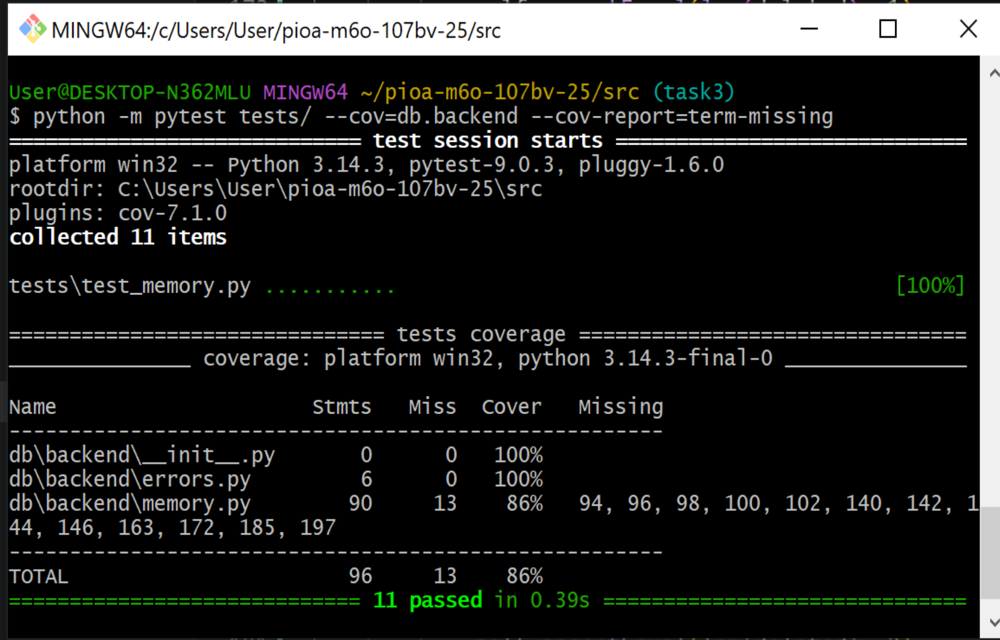

Тюрина Милана Андреевна
М6О-107БВ-25
python
Описание 2 и 3 лабы:
1. Папка PIOA-M6O-107BV-25 содержит папку src\db с папкой backend, которая реализует работу с базой данных(memory.py). Также src\db содержит `__init__.py`(для обозначения папки и при необходимости инициализации пространства имён), `__main__.py` (реализует функции, выполнения модуля или пакета как скрипта), tui.py (для работы с пользовательским интерфейсом). Папка src содержит папку tests, где есть `__init__.py` и `test_memory.py`. 
2. Функция реализует базу данных(список студентов): можно добавлять студентов с указанием id, имени и фамилии, возраста, пола. При добавлении данные сохраняются, и потом их можно искать по фильтрам(например, только по имени: будут найдены студенты с одинаковыми именами). Можно обновлять записи: сначала нужно найти их по фильтру(как в поиске по фильтру, то есть заполнять все поля необязательно), а потом обновить(обновлять все поля необязательно); созданы новые поля для нового имени, фамилии и т.д., функция возвращает `list[StudentRecord]`(список записей, которые были обновлены), в функцию main была добавлена эта функция(с вопросом, стоит ли обновить найденную запись(д\н)). Функция delete_record позволяет удалять записи после поиска подходящих записей по фильтру; есть подтверждение удаления; возвращает список удалённых записей. `test_memory.py` содержит тесты для функций создания записей(проверяет: правильное создание, нельзя создать запись с отрицательным возрастом, нельзя повторять айди), их поиска по фильтру(проверяет: правильная фильтрация, проверка работы разных фильтров), обновления(проверяет: правильное сохранение новой записи, нельзя обновить без фильтра, нельзя вызвать обновление без новых значений, нельзя ввести отрицательный возраст), удаления(проверяет: удаление нужной записи, нельзя удалить всё без указания параметров поиска, можно удалить несколько записей при совпадении фильтров). Исключая tui.py и `__main__.py` из покрытия, покрытие 86%.

3. Инструкция по запуску проекта:  
python -m db,

(тесты) python -m pytest tests/ --cov=db.backend --cov-report=term-missing